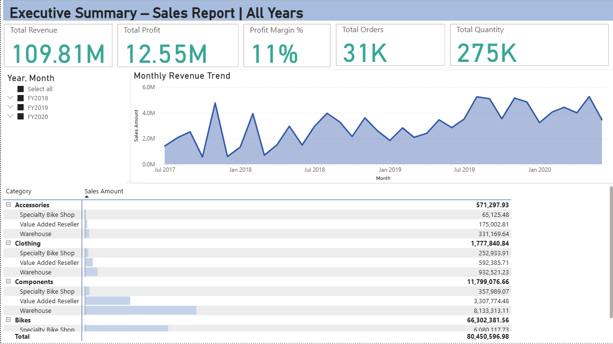
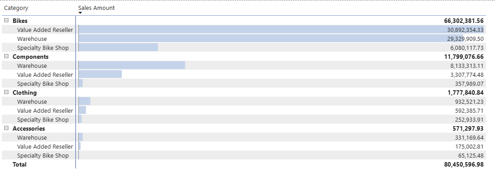
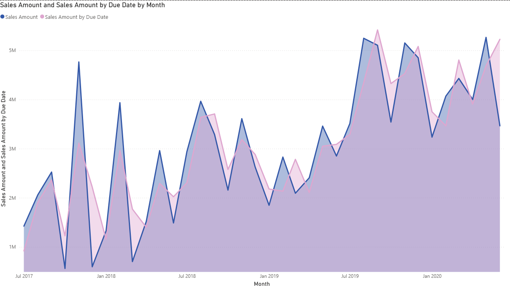

#  Executive Sales Dashboard — Power BI


---

## Overview

This project presents an **executive-level sales dashboard** built with Power BI to analyze revenue, profitability, and sales performance across multiple fiscal years.

The dashboard is designed to support **business decision-making** by providing clear KPIs, time-based trends, and category-level insights using real-world business logic.

---

**Business Impact:**  
This dashboard enables executives to quickly identify revenue drivers, loss-making categories, and performance trends to support data-driven decision-making.


## Key Business Questions

- How are total revenue and profit performing across fiscal years?
- Which product categories and sales channels drive the most revenue?
- How does monthly revenue trend over time?
- Are there periods or categories operating at a loss?
- How do order volume and sales quantity relate to revenue?

---

## Dashboard Highlights

### Dynamic KPI Cards
- Total Revenue
- Total Profit
- Profit Margin %
- Total Orders
- Total Quantity

### Dynamic Page Title
Automatically updates based on the selected fiscal year.

### Time-Series Analysis
Monthly revenue trends with interactive filtering.

### Category & Channel Breakdown
Revenue analysis by product category and sales channel.

### Data Quality Handling
- Blank fiscal periods excluded at the visual level
- Negative profit values preserved to reflect real business scenarios

---

## 📁Repository Structure

```bash
executive-sales-dashboard-powerbi/
│
├── README.md
│
├── dashboard/
│   └── Executive_Sales_Dashboard.pbix
│
├── data/
│   └── adventureworks_sales.xlsx
│
├── images/
│   ├── executive_summary_all_years.png
│   ├── executive_summary_fy2019.png
│   ├── category_channel_breakdown.png
│   └── sales_vs_due_date.png
│
└── docs/
    └── dashboard_overview.md
```

---

## Tools & Technologies

- Power BI Desktop
- DAX (measures, dynamic logic)
- Power Query
- Star Schema Data Modeling

---

**Skills Demonstrated**
- Power BI Dashboard Development
- DAX Measures & Calculations
- Data Modeling (Star Schema)
- Time Series Analysis
- Business KPI Design
- Data Visualization Best Practices


## 📸 Dashboard Preview

  
  


---

## Dataset

- AdventureWorks Sales Dataset

---

## Notes

- FY2021 is excluded due to the absence of actual sales data.
- Negative profit values are intentionally retained to highlight loss-making scenarios.

---
 ---

## 👤 Author

<div align="center">

**Ahmed Tarek**

*Data Scientist & Machine Learning Engineer*

[](https://github.com/ahmedtarek-mel)
[](https://linkedin.com/in/ahmed-tarek-mel)
[](mailto:your-email@example.com)

</div>

---
